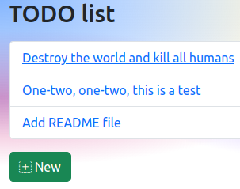

pyramid-demo
============



Description
-----------

This is a demo using:

- Python
- Poetry
- FastAPI
- SQLAlchemy
- Alembic
- Pyramid

Usage
-----

Configure application:

```
$ cp .env.example .env
$ vim .env
```

Install dependencies:

```
$ poetry install
```

Activate virtual environment:

```
$ poetry shell
```

Create database:

```
$ alembic upgrade head
```

Start API server:

```
$ python api.py
```

In another terminal, start web server:

```
$ poetry shell
$ python web.py
```

Exit virtual environment:

```
$ exit
```

Develop
-------

### Inspect database

```
$ sqlite3 todo.db
sqlite> .tables
sqlite> .schema alembic_version 
sqlite> .headers on
sqlite> .mode column
sqlite> select * from todos;
sqlite> .quit
```

### Update database

```
$ vim models.py
$ alembic revision --autogenerate -m "Message"
$ alembic upgrade head
```

TODO
----

- Add `docker-compose.yml`.
