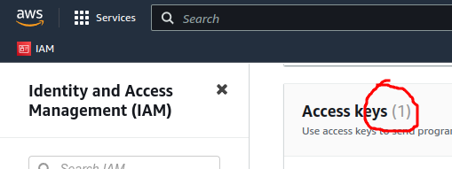

pyramid-demo
============


Description
-----------

This is a demo using:

- Python
- Poetry
- FastAPI
- SQLAlchemy
- Alembic
- Pyramid
- Docker
- AWS (IAM, EC2)
- Terraform
- Packer

This is a demo. Do not use in production.

Usage
-----

### Run with docker

Go inside docker directory:

```
$ cd docker
```

Customize host ports:

```
$ cp .env.example .env
$ vim .env
```

Run with docker-compose:

```
$ docker-compose up
```

Open with a web browser:

- http://localhost:8001/docs
- http://localhost:8001/redoc
- http://localhost:6543

Develop
-------

### Setup

Go inside source directory:

```
$ cd src
```

Configure application:

```
$ cp .env.example .env
$ vim .env
```

Install dependencies:

```
$ poetry install
```

Activate virtual environment:

```
$ poetry shell
```

Create database:

```
$ alembic upgrade head
```

Start API server:

```
$ python api.py
```

In another terminal, start web server:

```
$ cd src
$ poetry shell
$ python web.py
```

Open with a web browser:

- http://localhost:8001/docs
- http://localhost:8001/redoc
- http://localhost:6543

Exit virtual environment:

```
$ exit
```

### Inspect database

```
$ sqlite3 todo.db
sqlite> .tables
sqlite> .schema alembic_version 
sqlite> .headers on
sqlite> .mode column
sqlite> select * from todos;
sqlite> .quit
```

### Update database

```
$ vim models.py
$ alembic revision --autogenerate -m "Message"
$ alembic upgrade head
```

Deploy on AWS
-------------

Why are you reading this? It's not production-ready!

### Create IAM credentials

Create an access key for an admin user **who can manage IAM** (could be dangerous!):



Authenticate with `aws-cli`:

```
$ aws configure --profile admin
```

Customize variables if needed:

```
$ cd terraform/common
$ cp variables.tf.example variables.tf
$ vim variables.tf
```

Create credentials:

```
$ cd terraform/create_credentials
$ terraform apply
```

Get secret key:

```
$ vim terraform.tfstate
```

Authenticate with demo user:

```
$ aws configure --profile demo_user
```

Assume demo role:

```
$ export AWS_ACCOUNT=`aws --profile demo_user sts get-caller-identity --query Account --output text`
$ aws --profile demo_user sts assume-role --role-arn arn:aws:iam::$AWS_ACCOUNT:role/demo-role --role-session-name demo-session
```

Authenticate with demo session:

```
$ aws configure
```

Fill `aws_session_token`:

```
$ vim ~/.aws/credentials
```

Test access to EC2:

```
$ aws ec2 describe-instances
```

(Optional) Delete `admin` and `demo_user` profiles:

```
$ vim ~/.aws/config
$ vim ~/.aws/credentials
```

### Create AMI

Go inside packer directory:

```
$ cd packer
```

Customize Packer if needed:

```
$ cp demo.auto.pkrvars.hcl.example demo.auto.pkrvars.hcl
$ vim demo.auto.pkrvars.hcl
```

```
$ packer build .
$ aws ec2 describe-images --owner self --query Images[].[Name,ImageId] --output table
```

### Create VM

Customize variables if needed:

```
$ cd terraform/common
$ cp variables.tf.example variables.tf
$ vim variables.tf
```

Create VM:

```
$ cd terraform/create_vm
$ terraform apply
```

*(to be continued...)*

TODO
----

- Put all Terraform variables in `terraform/common`
